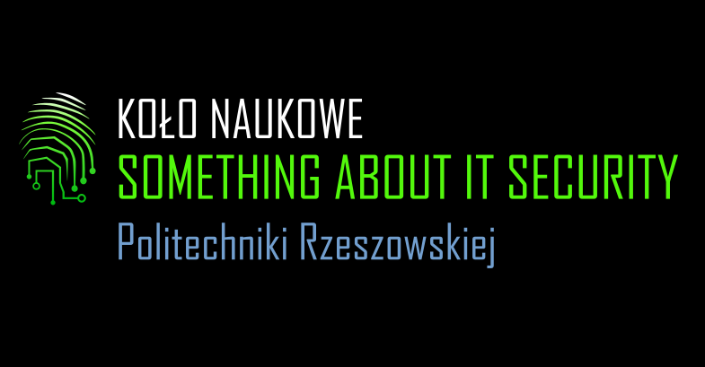

<a name="readme-top"></a>

<br />
<div align="center">
  <a href="https://github.com/benmotyka/saits_front">
    
  </a>
  <h1 align="center">Something About IT Security</h1>
  <h3 align="center">Science Club</h3>
  <h5 align="center">Rzeszow University of Technology</h5>
  <p align="center">
    <a href="https://saits.prz.edu.pl"><h4>Explore the page »</h4></a>
    <a href="https://github.com/benmotyka/saits_front/issues">Report Bug</a>
    ·
    <a href="https://github.com/benmotyka/saits_front/issues">Request Feature</a>
  </p>
</div>

<!-- TABLE OF CONTENTS -->
<details>
  <summary>Table of Contents</summary>
  <ol>
    <li>
      <a href="#about-the-project">About The Project</a>
      <ul>
        <li><a href="#built-with">Built With</a></li>
      </ul>
    </li>
    <li>
      <a href="#getting-started">Getting Started</a>
      <ul>
        <li><a href="#prerequisites">Prerequisites</a></li>
        <li><a href="#installation">Installation</a></li>
      </ul>
    </li>
    <li><a href="#contributing">Contributing</a></li>
    <li><a href="#contact">Contact</a></li>
  </ol>
</details>

<!-- ABOUT THE PROJECT -->

## About The Project

Simple one-page website of Something About IT Security - Rzeszow University of Technology Science Club. 

The main goal of the website is to present the club and its activities, as well as allow visitors to get in touch with club officials.
### Built With

* [![React][react.js]][react-url]
* [![styled-components][styled-components]][styled-components-url]

<!-- GETTING STARTED -->

## Getting Started

### Prerequisites

- [Node.js](https://nodejs.org/en/download/)
- (optional) [saits server](https://github.com/benmotyka/saits_api)

### Installation

1. Clone this repo
   ```sh
   git clone https://github.com/benmotyka/saits_front.git
   ```
2. Install NPM packages
   ```sh
   npm install
   ```
3. (optional) Run server (please refer to [https://github.com/benmotyka/saits_api](https://github.com/benmotyka/saits_api)) for more details
4. Run app
   ```sh
   npm start
   ```

<p align="right">(<a href="#readme-top">back to top</a>)</p>

<!-- CONTRIBUTING -->

## Contributing

Contributions are what make the open source community such an amazing place to learn, inspire, and create. Any contributions you make are **greatly appreciated**.

If you have a suggestion that would make this better, please fork the repo and create a pull request. You can also simply open an issue with the tag "enhancement".
Thanks again!

1. Fork the Project
2. Create your Feature Branch (`git checkout -b feature/AmazingFeature`)
3. Commit your Changes (`git commit -m 'Add some AmazingFeature'`)
4. Push to the Branch (`git push origin feature/AmazingFeature`)
5. Open a Pull Request

<p align="right">(<a href="#readme-top">back to top</a>)</p>

<!-- LICENSE
## License

Distributed under the MIT License. See `LICENSE.txt` for more information.

<p align="right">(<a href="#readme-top">back to top</a>)</p>
 -->

## Contact

Ben Motyka - [LinkedIn](https://www.linkedin.com/in/ben-motyka-97a729240/) - benmotykax@gmail.com

Project Link: [https://github.com/benmotyka/saits_front](https://github.com/benmotyka/saits_front)

<p align="right">(<a href="#readme-top">back to top</a>)</p>

[react.js]: https://img.shields.io/badge/React-20232A?style=for-the-badge&logo=react&logoColor=61DAFB
[react-url]: https://reactjs.org/
[styled-components]: https://img.shields.io/badge/styled--components-v5.3.1-orange
[styled-components-url]: https://styled-components.com/
